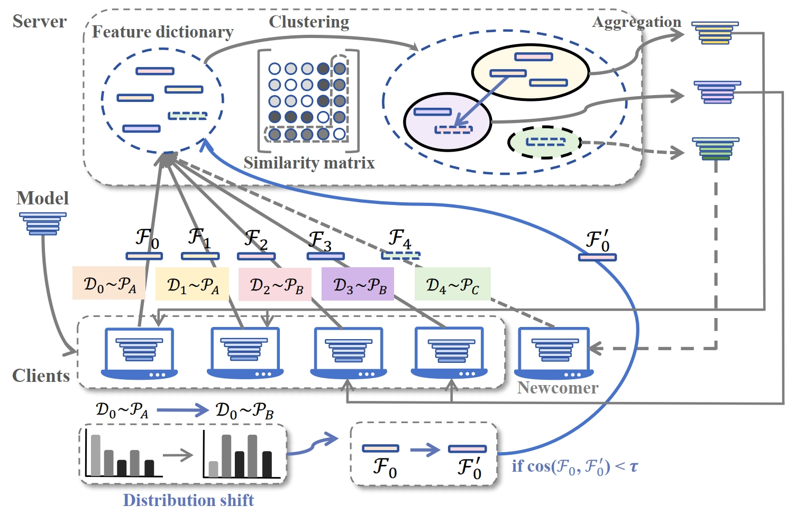

# Lightweight Clustered Federated Learning via Feature Extraction 

## Framework


## How to run the code
### Prepare the dataset
```bash
cd scripts
bash dataset_preparation.sh
```

Options for dataset: ```fmnist```, ```cifar10```, ```cinic```, ```stl10```, ```cifar100```, ```tiny```; 

Options for partition: ```pathological```, ```rotated```, ```rgb_hsv```, ```mix```, ```noniid-#label2```(heterogeneous); Specially for ```stl10```: ```pathological#2```


For FMNIST, CIFAR10, STL10, CIFAR100, datasets are automatically downloaded.

For CINIC10, you should download the dataset from [here](https://datashare.is.ed.ac.uk/handle/10283/3192) and unzip in the folder `data` and rename it to `cinic10`.
For Tiny-ImageNet, you should download the dataset from [here](http://cs231n.stanford.edu/tiny-imagenet-200.zip) and unzip it in the folder `data`.

The directory structure of the datasets should look like this:

```
FECFL-->data-->cinic10-->train
                |       |->test
                |       |->valid
                |->tiny-imagenet-200-->train
                |                     |->val
                |                     |->test
                |                     |->wnids.txt
                |                     |->words.txt
                ...
```


### Run the code
```bash
cd scripts
bash fecfl.sh
```

### Unsuperivsed task
```bash
cd unsupervised
bash fecfl_unsupervised.sh
```

### Distribution shift
```bash
cd distribution_shift
bash fecfl_shift.sh
```

## Citation
If you find this code useful, please consider citing our paper:
```bibtex
@inproceedings{lao2025lightweight,
  title={Lightweight Clustered Federated Learning via Feature Extraction},
  author={Lao, Guanzhang and Zhang, Xinglin and Li, Yun and Gong, Yue-Jiao},
  booktitle={ICASSP 2025-2025 IEEE International Conference on Acoustics, Speech and Signal Processing (ICASSP)},
  pages={1--5},
  year={2025},
  organization={IEEE}
}
```